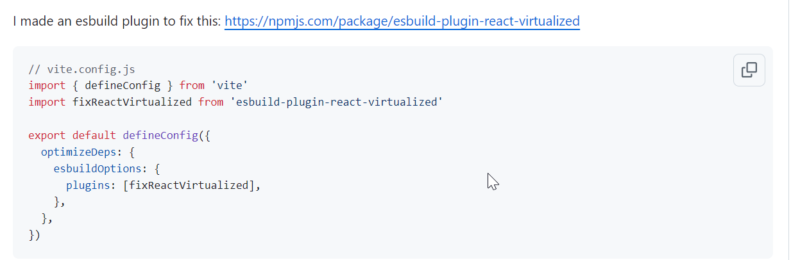

# React + Vite

TO DO:

- create one tab for yesterday's ticket upload
- create one tab for today's ticket upload
- create one tab for showing only new tickets
- create one tab for showing only high priority tickets
- creating one tab with latest worknotes per tickets .

This template provides a minimal setup to get React working in Vite with HMR and some ESLint rules.

Currently, two official plugins are available:

- [@vitejs/plugin-react](https://github.com/vitejs/vite-plugin-react/blob/main/packages/plugin-react/README.md) uses [Babel](https://babeljs.io/) for Fast Refresh
- [@vitejs/plugin-react-swc](https://github.com/vitejs/vite-plugin-react-swc) uses [SWC](https://swc.rs/) for Fast Refresh



```javascript
// vite.config.js
import { defineConfig } from "vite";
import fixReactVirtualized from "esbuild-plugin-react-virtualized";

export default defineConfig({
  optimizeDeps: {
    esbuildOptions: {
      plugins: [fixReactVirtualized],
    },
  },
});
```

https://github.com/bvaughn/react-virtualized/issues/1722

### React Virtualized ::

https://blog.logrocket.com/rendering-large-lists-react-virtualized/
